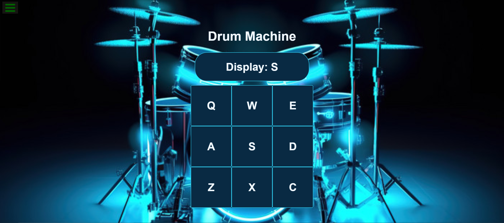

# build-drum-machine 🔁

## Description 📜

 Build a drum machine app that mimics the functionality of the reference drum machine provided here. The app should be designed using React, and it should fulfill the user stories listed in the freeCodeCamp curriculum.

## Features 🎉

- Play sounds by clicking on buttons or pressing corresponding keys on the keyboard.
- Display the name of the currently playing sound on the screen.
- Provide visual feedback (e.g., changing button colors) when sounds are played.
- Include a set of drum pads with different sound categories (e.g., Kick, Snare, Hi-Hat).
- Allow users to switch between different sound sets or banks.
- Ensure accessibility by supporting keyboard navigation and screen readers.

## User Stories 👧
1. I should be able to see an outer container with a corresponding `id="drum-machine"` that contains all other elements.
2. Within `#drum-machine` I can see an element with a corresponding `id="display"`.
3. Within `#drum-machine` I can see 9 clickable drum pad elements, each with a class name of `drum-pad`, a unique id that describes the audio clip the drum pad will be set up to trigger, and an inner text that corresponds to one of the following keys on the keyboard: Q, W, E, A, S, D, Z, X, C. The drum pads MUST be in this order.
4. Within each `.drum-pad`, there should be an HTML5 audio element which has a `src` attribute pointing to an audio clip, a class name of `clip`, and an id corresponding to the inner text of its parent `.drum-pad` (e.g. `id="Q"`, `id="W"`, `id="E"` etc.).
5. When I click on a `.drum-pad` element, the audio clip contained in its child audio element should be triggered.
6. When I press the trigger key associated with each `.drum-pad`, the audio clip contained in its child audio element should be triggered (e.g. pressing the Q key should trigger the drum pad which contains the string Q, pressing the W key should trigger the drum pad which contains the string W, etc.).
7. When a `.drum-pad` is triggered, a string describing the associated audio clip is displayed as the inner text of the `#display` element (each string must be unique).


## Demo 📸
deployment link [(https://drum-machine-farwaamhubzada.netlify.app/)]




## Technologies Used 💡

- React
- CSS

## Installation 🔧

1. Clone the repository:
```bash
   git clone git@github.com:FarwaMuhibZada/build-drum-machine.git
   cd build-drum-machine
```
2. Install dependencies:
```bash
npm install
```

3. Start the development server:
```bash 
npm start
```

# Usage 🔊
Open your browser to http://localhost:3000 to view the app. You can click the on buttons  button to hear new  different sound.

# Acknowledgments
- freeCodeCamp for the project idea


## FarwaMuhibzada 👩‍💻

- LinkedIn: [(https://www.linkedin.com/in/farwamohibzada/)]
- Email:  [(farwafarid2017@gmail.com)]


# Contributing 🙏
Contributions are welcome! Please fork this repository and submit a pull request for any improvements or bug fixes.

